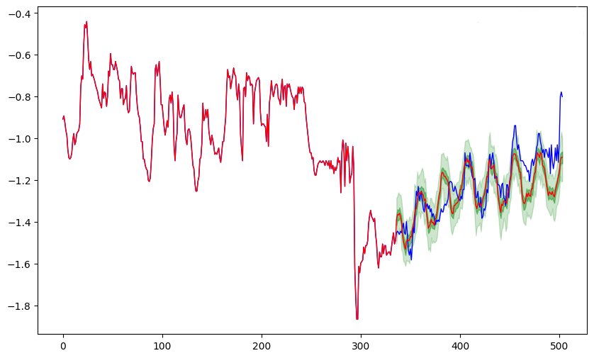
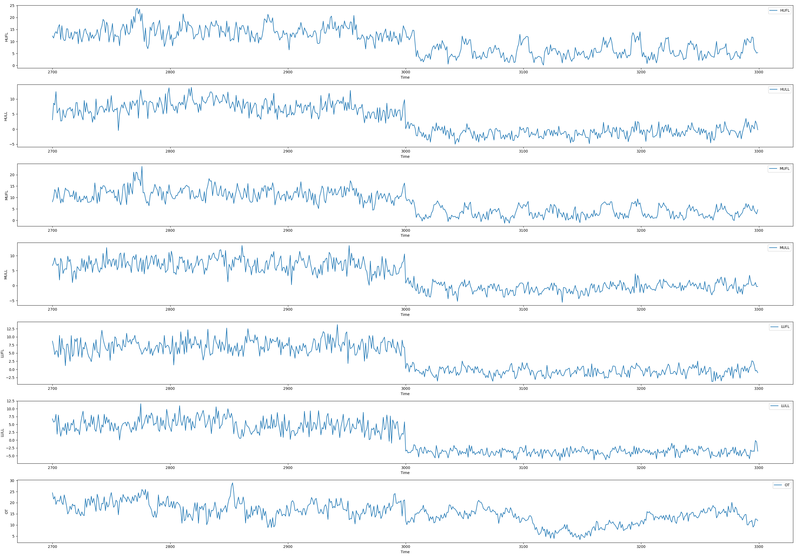
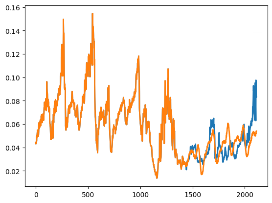

<div align="center">

# SimDiff: Simpler Yet Better Diffusion Model for Time Series Point Forecasting

[](https://arxiv.org/pdf/ )

📕 **Official implementation for AAAI 2026 paper**: SimDiff: Simpler Yet Better Diffusion Model for Time Series Point Forecasting

</div>

## 📖 Overview

<div align="center">
  
</div>

Diffusion-based time series forecasters have recently shown strong probabilistic modeling ability, but they still struggle to match regression-style methods on point forecasts: they often lack sufficient contextual bias to track distribution shifts and face a hard trade-off between sample diversity and the stability required for low MSE/MAE. Existing approaches frequently rely on external pre-trained or jointly trained regressors to stabilize training, which complicates the pipeline and sacrifices the generative flexibility that diffusion models should provide. 

**SimDiff** is a simple yet effective diffusion framework that closes this gap, with three core components:

- Unified End-to-End Diffusion Forecaster: A single Transformer backbone simultaneously serves as denoiser and predictor, removing the need for any external pre-trained or jointly trained regressors while still providing strong contextual bias from the history window. 
- Normalization Independence for Drift-Robust Training: A diffusion-specific normalization scheme decouples the statistics of past and future segments, allowing the model to handle temporal distribution shifts without data leakage and significantly improving robustness on OOD-prone datasets. 
- Median-of-Means Ensemble for Trustworthy Point Estimates: By ensembling diverse diffusion samples with a Median-of-Means estimator, SimDiff converts rich predictive distributions into stable point forecasts, reducing the influence of outliers and achieving consistently lower MSE. 

Across nine multivariate benchmarks, SimDiff attains state-of-the-art point forecasting performance—achieving the best or second-best MSE on all datasets—while also matching leading probabilistic baselines in CRPS/CRPS-sum, and delivers over 90% faster single-sample inference than prior diffusion-based models. 


**Example of Prediction Results**
<p align="center">

  <div style="display:inline-block; width:30%; text-align:center;">
    
    <br>
    <sub>(a) CSDI</sub>
  </div>

  <div style="display:inline-block; width:30%; text-align:center;">
    
    <br>
    <sub>(b) TimeDiff</sub>
  </div>

  <div style="display:inline-block; width:30%; text-align:center;">
    
    <br>
    <sub>(c) SimDiff</sub>
  </div>

</p>


**Normalization Independence alleviates OOD**

<p align="center">

  <div style="display:inline-block; width:30%; text-align:center;">
    
    <br>
    <sub>(a) Synthetic data with OOD</sub>
  </div>

  <div style="display:inline-block; width:30%; text-align:center;">
    
    <br>
    <sub>(b)  Norm. Independence</sub>
  </div>

  <div style="display:inline-block; width:30%; text-align:center;">
    
    <br>
    <sub>(c) Z-Score Normalization</sub>
  </div>

</p>


## 🚀 Quickstart

### 📦 Installation

Create and activate the conda environment:

```bash
conda create -n simdiff python=3.10
pip install -r requirements.txt
conda activate simdiff
```

You may install other necessary packages depending on the runtime requirements.


### ▶️ Running the Training and Inference


```bash
# Usage:
# Drag the script from the script folder to the home directory, then run:
chmod +x xxx.sh
./xxx.sh
```

For datasets with large size(e.g., Traffic, Electricity), can be found in the official implementation of Autoformer:https://github.com/thuml/Autoformer?tab=readme-ov-file


## 🏆 Acknowledgements:

Special thanks to the codebase/repository and the developers of [TimesNet](https://github.com/thuml/Time-Series-Library) and [TimeDiff](https://arxiv.org/abs/2306.05043) for providing invaluable resources and contributions which are instrumental in the progress and completion of this work.


## ✍️ Citation
If you use our work or are inspired by our work, please consider cite us:
```
@misc{ ,
      title={SimDiff: Simpler Yet Better Diffusion Model for Time Series Point Forecasting}, 
      author={Hang Ding,},
      year={2025},
      eprint={2511. },
      archivePrefix={arXiv},
      primaryClass={cs.AI},
      url={https://arxiv.org/abs/2511. }, 
}
```

